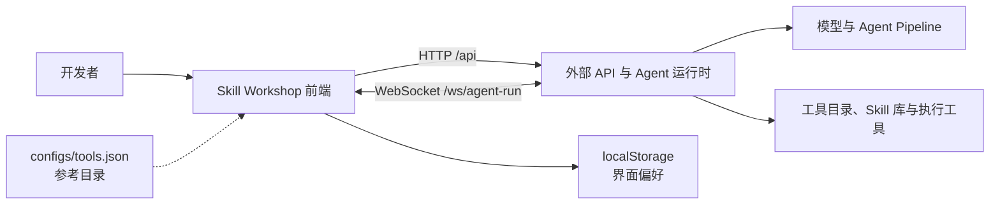

# Skill Workshop 软件设计说明

## 1. 文档定位

本文描述 Skill Workshop 前端当前采用的设计和运行边界。内容以仓库中的实现为准，不把尚未落地的能力写成既有功能。

Skill Workshop 面向需要编排 Agent Skill 的开发者。它把三类工作放在同一个浏览器界面中：查看 6G 核心网拓扑、通过图编辑 Skill、观察一次意图执行过程中产生的路由和运行事件。

本仓库只保留前端代码。HTTP API、WebSocket 服务、模型调用和工具执行由外部后端承担。

## 2. 设计目标与边界

### 2.1 目标

- 用可视化有向图表达 Skill 的执行顺序、分支和控制节点。
- 在图结构与 Markdown Skill 文档之间进行确定性的双向转换。
- 从后端加载工具目录和 Skill 库，避免在页面中维护重复数据。
- 通过 WebSocket 展示生成过程、Agent 输出、路由结果和网络事件。
- 复用统一的页面外壳、导航和状态管理，保持三个主视图的交互一致。

### 2.2 非目标

- 前端不负责模型推理、工具执行或 Skill 路由决策。
- 当前版本不提供账号、权限和多租户隔离。
- 当前版本不持久化 Skill、聊天记录或执行历史。
- Architecture 页面不编辑真实网络配置，也不从网管系统同步实时拓扑。

## 3. 系统上下文



前端负责编辑状态、展示和协议适配；后端负责数据来源和实际运行。`configs/tools.json` 是仓库内的参考目录，页面运行时仍以 `/api/tools` 返回的数据为准。

## 4. 前端结构

### 4.1 应用入口与路由

`src/App.tsx` 使用 `BrowserRouter` 注册三个页面：

| 路径 | 页面 | 主要职责 |
| --- | --- | --- |
| `/` | `ArchitecturePage` | 展示只读的 6G 网络拓扑。 |
| `/workshop` | `Workspace` | 编辑 Skill 图、属性和 Markdown。 |
| `/execution` | `ExecutionPage` | 发起意图并观察实时执行事件。 |

`AppShell` 和 `NavHeader` 提供共享的页面框架。Workshop 在框架内组合聊天区、图编辑区和右侧检查区；Architecture 与 Execution 复用导航和主内容容器。

应用挂载后会请求工具目录。Skill Library 在需要展示数据时请求 Skill 列表，结果进入全局 Store，供弹窗和路由提示共同使用。

### 4.2 状态管理

`src/store/useStore.ts` 使用 Zustand 管理跨组件状态，主要分为以下几组：

- Skill 文档：节点、边、视口、元数据、校验结果和执行状态。
- Markdown：当前原文、解析错误以及图与文档之间的同步结果。
- 后端数据：工具目录、Skill 列表、加载状态和错误信息。
- 交互状态：当前选中的节点或边、侧栏标签、弹窗状态和匹配到的 Skill。
- Agent 会话：聊天消息、流式内容、思考内容、模型选择和运行阶段。

Store 中的修改动作同时维护派生状态。例如节点内容发生变化时，会更新 `SkillDocument.updatedAt`，重新生成 Markdown，并把校验或执行信息写入时间线。

页面宽度、折叠状态和选中的面板标签使用 `localStorage` 保存。这些数据只属于界面偏好，不作为业务文档的持久化方案。

### 4.3 Skill 数据模型

`src/schemas/skill.ts` 用 Zod 定义运行时可校验的数据结构。核心对象如下：

| 对象 | 作用 |
| --- | --- |
| `SkillDocument` | Skill 的聚合根，包含节点、边、视口、元数据、校验和执行记录。 |
| `SkillNode` | 表达工具步骤或控制节点，并携带卡片类型、位置、属性和出口。 |
| `SkillEdge` | 连接一个节点出口与目标节点，当前边类型固定为 `workflow`。 |
| `MarkdownSkillDocument` | Markdown 解析后的结构化结果，包括 front matter、工具清单和工作流。 |

节点的 `cardType` 支持 `start`、`action`、`branch`、`loop`、`parallel`、`success` 和 `failure`。工作流边只描述控制流，不建立独立的参数连线系统。工具参数保存在节点属性和 Markdown 调用中。

### 4.4 图与 Markdown 的同步

`src/lib/skillMarkdown.ts` 和 `src/lib/graph.ts` 构成编辑器的转换层：

1. 后端或文件提供 Markdown。
2. 解析器读取 YAML front matter、工具清单和 Workflow 代码块。
3. 解析结果转换成 `SkillDocument`，随后进行自动布局。
4. `GraphEditor` 将文档映射为 React Flow 的节点和边。
5. 用户修改图后，Store 重新生成 Markdown，右侧预览立即更新。

转换过程采用规则和 Schema 校验，不依赖模型猜测文档结构。固定的 Start 节点不能删除；工具调用会与后端工具目录进行名称和必填参数校验。

### 4.5 Architecture 视图

Architecture 页面复用 `@xyflow/react` 的缩放、平移和节点交互能力。拓扑节点与连线由 `src/lib/architectureData.ts` 静态定义，包含终端、接入网、核心网功能、Agent、注册中心和网关等类型。

该视图只用于解释系统上下文。点击节点可以查看信息，但不会修改 Store 中的 Skill，也不会向真实网络下发配置。

### 4.6 Execution 视图

Execution 页面接收一段自然语言意图，通过 WebSocket 发送给后端，并维护两组临时数据：

- `AIPayload`：用户或 Agent 的文本、思考片段和流式更新。
- `Packet`：来源、目的、协议、摘要和详细载荷，用于类似抓包工具的列表展示。

页面还维护处理状态、进度、当前选中的数据包以及匹配到的 Skill。连接在页面卸载、任务完成或新任务开始时关闭。当前实现没有断线重连和历史恢复。

## 5. 后端接口

### 5.1 地址解析

共享 API 客户端按以下优先级解析地址：

1. `VITE_API_BASE_URL` 直接指定 HTTP API 根地址。
2. 未设置时，使用当前页面协议和主机，加上 `VITE_API_PORT`；端口默认是 `8080`，路径为 `/api`。
3. `VITE_WS_BASE_URL` 直接指定 WebSocket 根地址。
4. 未设置时，从 HTTP 地址推导 `ws` 或 `wss` 地址，并把路径改为 `/ws`。

### 5.2 HTTP 接口

| 方法与路径 | 用途 | 前端使用的数据 |
| --- | --- | --- |
| `GET /api/health` | 检查后端可用性。 | `{ ok: boolean }` |
| `GET /api/tools` | 获取工具目录。 | `tools`、`tool_names`、`by_name` |
| `GET /api/skills` | 获取 Skill 库。 | `skills[]`，每项包含 `id`、`name`、`description`、`definition` |

非 2xx 响应会转换为 Error。工具或 Skill 加载失败时，Store 保存错误信息，页面不使用仓库中的参考目录静默替代后端结果。

### 5.3 Skill 生成 WebSocket

Workshop 连接 `${VITE_WS_BASE_URL}/agent-run`，连接成功后发送：

```json
{
  "type": "start_run",
  "run_id": "<uuid>",
  "messages": [],
  "current_skill_markdown": "...",
  "reasoning_enabled": true,
  "context": {}
}
```

共享客户端处理 `run_started`、`session_event`、`run_complete` 和 `run_error`。`session_event` 中的 ADK 数据由 `src/lib/adkEvents.ts` 适配成页面阶段、消息、工具调用和 Markdown 产物。完成或失败后关闭连接并结束 Promise。

### 5.4 意图执行 WebSocket

Execution 页面使用同一路径，但发送另一类消息：

```json
{
  "type": "execute_intent",
  "data": {
    "intent": "...",
    "scenarioId": "ACN"
  }
}
```

页面当前识别以下事件：

| 事件 | 页面行为 |
| --- | --- |
| `routing_decision` | 更新匹配到的 Skill，并允许打开 Skill Library。 |
| `ai_payload` | 新增或合并 Agent 的最终文本。 |
| `llm_thought` | 追加模型思考片段。 |
| `network_pcap` | 新增一条网络事件记录。 |
| `workflow_complete` | 完成进度并关闭连接。 |

这套执行协议与 Workshop 的生成协议共享 URL，但消息结构和前端处理代码相互独立。

## 6. 关键数据流

### 6.1 编辑已有 Skill

```text
后端 Skill definition
  -> Markdown 解析与工具校验
  -> SkillDocument
  -> 自动布局
  -> React Flow
  -> 用户编辑
  -> Zustand action
  -> Markdown 重新生成
```

### 6.2 通过 Agent 生成或修改 Skill

```text
用户提示词
  -> start_run
  -> session_event 流
  -> ADK 事件适配
  -> 消息与工具调用展示
  -> Markdown 产物
  -> 解析并替换当前 SkillDocument
```

Markdown 无法解析时，Store 保留现有工作流并记录 warning，避免一次格式错误清空用户正在编辑的文档。

### 6.3 执行意图

```text
用户意图
  -> execute_intent
  -> 后端路由与 Agent 执行
  -> routing / payload / thought / pcap 事件
  -> Execution 页面增量渲染
  -> workflow_complete
```

## 7. 校验与错误处理

- Zod 负责 Skill 文档的结构校验。
- Markdown 转换器检查 front matter、Workflow 块和工具调用格式。
- Store 维护 errors、warnings 和时间线，供 Validation 与 Log 面板展示。
- HTTP 请求检查状态码，并优先使用后端返回的错误信息。
- WebSocket 在错误、提前关闭或 `run_error` 时终止本次运行。
- Skill 生成失败时保留用户已有文档；Execution 失败时停止 processing 状态。

当前没有统一的重试、超时和重连策略。Execution 页面中的事件 `data` 仍以 `unknown` 接收后直接拆解，类型边界不完整；Architecture 节点数据也存在强制类型转换。这两处会影响严格 TypeScript 构建。

## 8. 测试策略

现有测试使用 Node test runner，覆盖四个主要区域：

- ADK 事件到页面消息、阶段和工具调用的适配。
- 图自动布局和节点间距。
- Markdown 与 `SkillDocument` 的双向转换。
- Store 在图编辑、固定节点保护和文档加载时的行为。

测试侧重纯函数和 Store 行为，目前没有浏览器端组件测试、WebSocket 集成测试或端到端测试。与后端联调时还需要验证两类 `/ws/agent-run` 协议是否保持兼容。

## 9. 部署与运行约束

前端由 Vite 构建为静态文件，可由任意支持 SPA fallback 的 Web Server 托管。部署环境必须在构建阶段提供正确的 `VITE_*` 变量，并保证浏览器可以访问外部 API 和 WebSocket 服务。

仓库中的 `Dockerfile`、`docker/start-container.sh` 和 `npm run api` 来自前后端同仓时期，仍引用已经删除的 `backend/` 目录。它们不能代表当前可用的独立部署方案。在重新接入外部后端镜像或反向代理配置前，应分别部署前端和后端。

## 10. 已知限制

- Skill、聊天和执行数据只存在于内存中，刷新页面即丢失。
- 前端协议没有认证、授权和租户信息。
- Workshop 与 Execution 各自维护 WebSocket 处理逻辑，存在协议漂移风险。
- Execution 的事件载荷缺少运行时 Schema 校验。
- Architecture 使用静态拓扑，不能反映实时网络状态。
- 大量流式事件会直接触发 React 状态更新，尚未做批处理或背压控制。
- 现有容器构建配置与“后端已拆仓”的实际边界不一致。

